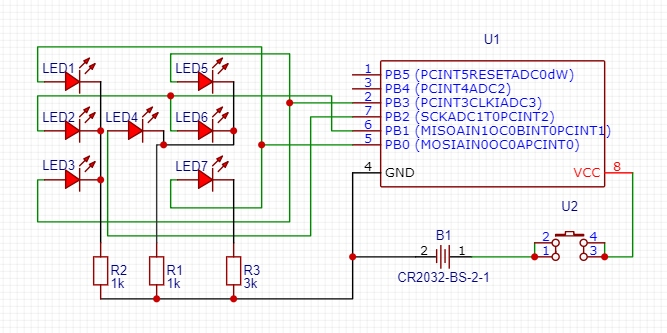

# Simple 'fair' electronic die

## Motivation
There was a thought to create "a fair die" as ALAP project (as light as possible). Such designs typically use two switches - one as a power switch and the other as an external trigger to "roll the dice".

This project solved the biggest drawback of "two-input cubes" - power consumption.

## From the beginning
When using PRNG (e.g. the 'random' function in Arduino IDE), such an algorithm is based on the uC operating time - the reason for using two switches, thanks to which the user has the ability to influence the output result.

## Requirements
* Of course, the new design should only include one switch responsible for delivering power.
* The second requirement is the number of pins used to display the state of the six-sided die.

# Physical part
ATTiny13A-PU (DIP8) was chosen as the uC, which provides 8 pins:
- 2 for power supply: GND and VCC;
- 6 GPIOs.

To control seven LEDs as one six-sided dice, simply connect the four pins as shown below:
| C | _ | B |
|:-:|:-:|:-:|
| D | A | D |
| B | _ | C |

where you can display further numbers by powering these sets of LEDs:
| Number | LEDs to ON |
|:------:|:----------:|
| 1      | A          |
| 2      | B          |
| 3      | A and B    |
| 4      | B and C    |
| 5      | A, B and C |
| 6      | B, C and D |

Electrical connection diagram

The device is powered by one CR2032 cell.

# Logical part
There are basically two main sources of random seeds in ATTiny13A, seed:
- based on time;
- based on analog readings.

Due to the first requirement, there is no way to measure the lifetime of the uC, so the second option remains.
To measure "random" noise, leave the analog pin floating - much like an antenna will pick up noise from the electrical environment.
Unfortunately, it is highly impossible to obtain a square (or equal) distribution of these readings. Which specifies the output in a low range, such as 2 or 3 possibilities.

At this time, raw readings cannot be used to randomly select a value from 1 to 6. However, it is possible to equalize their probabilities.

## Equal distribution algorithm
ATTiny13 should store "rolled" values as counts in an array like this:
| 1 | 2 | 3 | 4 | 5 | 6 |
|:-:|:-:|:-:|:-:|:-:|:-:|
| 0 | 0 | 0 | 0 | 0 | 0 |

which can be done with the internal EEPROM.
Two rows (numbers and frequency) and six columns (as a six-sided die).

1. First, the program reads this array and creates a sorted copy (by second row) in ascending order.
2. The algorithm checks the 1st, 3rd and 5th elements of this table and saves them as a new 2x3-element array - a table of possible numbers.
3. At this point the uC reads the analog pin and converts the result value as index "i" from 0 to 2,  where 0 indicates the first element of the new table.
4. The final number is written to the new table in the ith position, which is the "rolled" value.
5.1 The individual counter (stored in EEPROM) of the "rolled" value is incremented.
5.2 Due to the maximum value of the counters (e.g. 255), it should be checked whether it is possible to exceed them. If so, all counters are decremented by the value of the least frequent number found in the second row.
6. The randomly selected value is displayed on the LEDs.

[Simple example with 30 iterations](example.txt)

The entire algorithm works in a closed loop, where the frequency of each number is feedback.
Depending on the selected elements (1st, 3rd and 5th) from the main table, can be choose the least frequent number, e.g. from 1 to 3.
Additionally, it is not possible to select the same most frequently occurring number all the time, so it is a system with negative feedback - a self-stabilizing system (stable system).

If the weakest item (1st) is not selected or is still the least frequent, it will be moved to the next round until it is as common as the second least frequent number.

It's not pure RNG, but this algorithm can provide fair (or equal) results.

It is possible to clear table (set 0) by pressing button for 10 seconds. As confirmation of this process all LEDs should light up.

